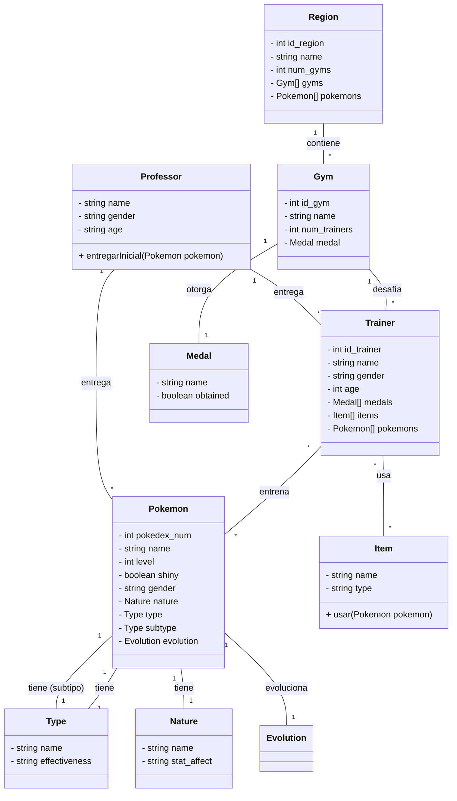

```mermaid
classDiagram
    class Region {
        - int id_region
        - string name
        - int num_gyms
        - Gym[] gyms
        - Pokemon[] pokemons
    }

    class Gym {
        - int id_gym
        - string name
        - int num_trainers
        - Medal medal
    }

    class Pokemon {
        - int pokedex_num
        - string name
        - int level
        - boolean shiny
        - string gender
        - Nature nature
        - Type type
        - Type subtype
        - Evolution evolution
    }

    class Trainer {
        - int id_trainer
        - string name
        - string gender
        - int age
        - Medal[] medals
        - Item[] items
        - Pokemon[] pokemons
    }

    class Professor {
        - string name
        - string gender
        - string age
        + entregarInicial(Pokemon pokemon)
    }

    class Nature {
        - string name
        - string stat_affect
    }

    class Type {
        - string name
        - string effectiveness
    }

    class Item {
        - string name
        - string type
        + usar(Pokemon pokemon)
    }

    class Medal {
        - string name
        - boolean obtained
    }

    Region "1" -- "*" Gym : contiene
    Gym "1" -- "*" Trainer : desafía
    Gym "1" -- "1" Medal : otorga
    Trainer "*" -- "*" Pokemon : entrena
    Trainer "*" -- "*" Item : usa
    Pokemon "1" -- "1" Type : tiene
    Pokemon "1" -- "1" Type : tiene (subtipo)
    Pokemon "1" -- "1" Nature : tiene
    Pokemon "1" -- "1" Evolution : evoluciona
    Professor "1" -- "*" Trainer : entrega
    Professor "1" -- "*" Pokemon : entrega

```
apps-fileview.texmex_20250313.01_p0
P2.txt
Mostrando P2.txt.